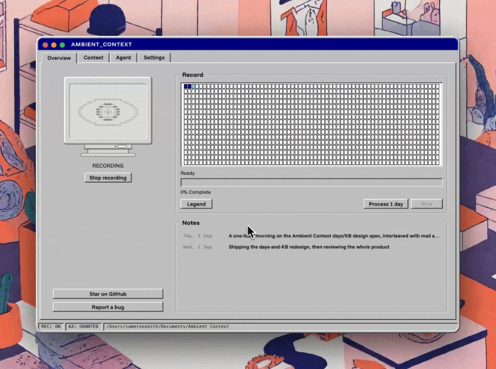

# Ambient Context

A macOS menu bar app that keeps a written record of what you work on, for
your own LLM to read.

<p align="center">
  
</p>

While the eye in your menu bar is open, Ambient Context reads the text of
whichever window you have focused (via the macOS accessibility tree, every
few seconds) and appends it to a plain markdown file: one file per day, in
a folder you choose. Point Claude Code or any other agent at that folder
and it can answer "what did I work on Tuesday?", build memory about your
projects, or write your standup for you.

- **No screenshots, no video.** It reads text through the accessibility
  API, nothing else.
- **No built-in upload.** No account, no server, no telemetry, no bundled
  model. This build's capture pipeline makes no network calls; the signed
  release will add a single update check against GitHub. A synced output
  folder or hosted agent is a separate data boundary you control.
- **Files you own.** Plain markdown in a folder you chose. Move them,
  grep them, delete them.
- **Redaction before writing.** Recognized password-manager and private-
  browsing snapshots are discarded before writing. Secure password fields
  are skipped at the source, and recognized credentials, API keys and
  card-shaped numbers are scrubbed before anything touches disk.
- **Built to be read by an LLM.** Lines are deduplicated across the day,
  interface junk is filtered out, and blocks record a document path or URL
  where the focused application exposes one. The folder carries an
  `AGENTS.md` explaining the format to whatever reads it.

Requires macOS 14+ on Apple Silicon.

## Documentation

- [Architecture](docs/architecture.md) — capture lifecycle, component map,
  data flow and failure behavior
- [Privacy and security](docs/privacy-and-security.md) — trust boundary,
  control layers, claims matrix and known gaps
- [Capture format](docs/capture-format.md) — file contract, deduplication and
  safe interpretation rules
- [Coverage census](docs/census.md) — manual application-compatibility and
  Chromium-cost test protocol
- [Day-context prompt](docs/day-context-prompt.md) — optional prompt for
  distilling one captured day

## Status

Early and unsigned. There is no notarised download yet (Apple Developer
enrolment is in progress), so for now you build it yourself, which takes
about two minutes:

## Build and run

You need [Node](https://nodejs.org), [Rust](https://rustup.rs) and Xcode
Command Line Tools.

```bash
git clone https://github.com/dragthelake/ambient-context
cd ambient-context
npm install
npm run tauri build -- --bundles app --config '{"bundle":{"createUpdaterArtifacts":false}}'
```

The app lands in `src-tauri/target/release/bundle/macos/`. Drag
`Ambient Context.app` to Applications and open it.

The config override disables release-updater artifacts, which require the
maintainer's private signing key. Release maintainers can use the ordinary
`npm run tauri build` command with that key configured.

For development, `npm run tauri dev` runs it with hot reload.

## First run

1. The settings window opens by itself. Grant Accessibility when asked:
   this is the permission that lets the app read window text, and nothing
   works without it.
2. Choose where to save. The default is `~/Ambient Context`, deliberately
   outside `~/Documents` so iCloud does not sync your record off the
   machine.
3. That's it. Recording starts once setup is complete and starts with the
   app from then on. Click the eye in the menu bar to stop; stopping is
   remembered until you start again.

Open eye: recording. Closed eye: not. Right-click the icon for today's
file, the folder and settings.

## What a day file looks like

```markdown
---
date: 2026-08-25
captured_by: Ambient Context 0.1.0
---

## 09:41–10:05 · Chrome · Tauri tray documentation

url: https://v2.tauri.app/learn/system-tray/

<text seen in that window, first time it appeared today>
```

Block headings are the day's timeline. Body lines are written once per day
no matter how often they are seen, so the file stays small enough to hand
to an LLM whole. `AGENTS.md` in the capture folder documents the format
and how to read it well.

## Notes for testers

- Chromium and Electron apps (Chrome, Slack, VS Code, Obsidian, Figma...)
  only build their accessibility tree when asked, so the first seconds of
  capture in those apps are thin and fill in on later passes. Chrome may
  show a slightly glitchy window-resize animation while enabled; that is a
  known cost of the mechanism.
- GPU-rendered terminals (Kitty, Alacritty) expose little or no text.
  Terminal.app and iTerm2 work.
- Capture your findings: which apps come back rich, partial or empty is
  exactly the feedback that helps (`docs/census.md` has the template).

## Tests

```bash
cd src-tauri && cargo test
```

## Privacy model, in one paragraph

The app asks macOS for the frontmost application's focused window and does
not enumerate background or minimised windows. It returns no snapshot while
the screen is locked, skips secure input subtrees at the Accessibility level,
discards snapshots matching its known password-manager and private-browser
rules, and pattern-scrubs recognized secrets before writing. Everything it
produces is plaintext on your own disk. Self-capture avoidance and redaction
are defense-in-depth heuristics, not guarantees, and a folder you sync or give
to a hosted agent may leave the machine. Read the full
[privacy and security model](docs/privacy-and-security.md); if you find a
hole, please open an issue without including real captured secrets.
