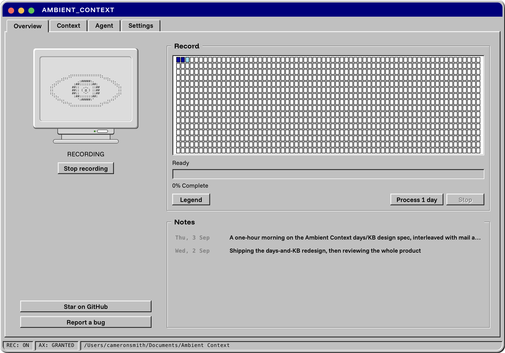

# Ambient Context

**Ambient Context writes it down what you work on during the day to give your AI assistant better context**

A macOS menu bar app that keeps a written record of what you work on, in
plain markdown, in a folder you own. Point Claude Code, Cursor, Codex or
any MCP client at your context folder. 

<p align="center">
  
</p>

<!-- SCREENSHOT: Overview window, 2 columns, CRT + controls on the left, Record map on the right, a few days marked Processed -->
<!--  -->

## The problem

You spend the day reading, writing, replying and deciding. None of it
reaches the AI assistant you open at 4pm. So you paste in the email, explain
the ticket, summarise the call, and the model still works from a fraction
of what you actually saw. The context existed. It was on your screen. Nobody
wrote it down.

## What Ambient Context does

While the eye in your menu bar is open, the app reads the text of whichever
window you have focused (through the macOS accessibility tree, every few
seconds) and appends it to markdown files for the day. At a time you
choose, or when you press the button, an agent you already have turns that
record into two more things: a small cited knowledge base and a written
summary of the day.

Three files per day, each one useful on its own:

| | What it is | Who it is for |
|---|---|---|
| **Context** | The record. What was on screen, when, in which app, with the file path or URL where the app exposes one. | Agents that need evidence. Grep. You, when you cannot remember which tab it was in. |
| **Knowledge** | Six cited pages built from the record: People, Commitments, Threads, Products, Issues, Reading. Every claim points back to a block in the record. | Agents building memory about your projects and the people in them. |
| **Notes** | The day written up from the knowledge base, with citations checked against the record before it is saved. | You, at the end of the day. Your standup. The model you open tomorrow morning. |

<!-- SCREENSHOT: Day view on the Knowledge tab, People section visible with citations -->
<!--  -->

## How it works

1. **Record.** Grant Accessibility, choose a folder, and the eye opens.
   Capture starts with the app from then on. Click the eye to stop;
   stopping is remembered until you start again.
2. **Process.** Connect an agent CLI you already have (Claude Code, Codex or
   opencode). Set a time, or press Process day. The agent reads the record
   and writes the knowledge and the notes. It runs on your machine under
   your own subscription; Ambient Context never makes a model call itself.
3. **Ask.** Register the app as an MCP server in Claude Code, Claude
   Desktop, Cursor or Zed, or just point an agent at the folder. Twenty
   tools cover reading days, searching the record, reading the knowledge
   and notes, and controlling capture.

<!-- SCREENSHOT: Claude Code terminal answering "what did I work on Tuesday?" via the MCP server -->
<!--  -->

## Why the record is worth reading

Raw screen text is noisy. Ambient Context is built so an LLM can read it
cheaply.

- **Deduplicated across the day.** A page you keep coming back to is
  recorded once, not once per poll.
- **Interface junk filtered.** View counts, "8 minutes ago", media player
  positions and navigation menus are dropped. On two real days of capture
  this removed about a fifth of the lines without losing content.
- **Real references, not scraped fragments.** Blocks record the document
  path or URL where the app exposes one, so a reader can open the actual
  file instead of trusting the excerpt.
- **Mail and chat go to their own file.** Messages are routed to
  `messages.md` so the timeline stays readable and message bodies are easy
  to exclude from a prompt.
- **A `AGENTS.md` in the folder** explains the format to whatever reads it.

## Privacy

The record is yours and it stays on your computer.

- **No screenshots, no video, no OCR.** Text only, from the accessibility
  API, and only from the focused window. Never while the screen is locked.
- **No account, no server, no telemetry.** The app does not upload your
  record. The optional update check reaches GitHub Releases and nothing
  else.
- **Files you own.** Plain markdown in a folder you chose. Move them, grep
  them, delete them.
- **Defence in depth before writing.** Secure password fields are skipped
  at the source. Password managers and private browsing windows are never
  recorded. Credential, API-key and card-shaped strings are scrubbed to
  `[redacted]`. These are heuristics, not a guarantee, so treat the folder
  as sensitive.
- **Boundaries you choose are named as such.** An agent CLI you connect and
  a synced folder (iCloud, Dropbox) are separate trust decisions. The app
  warns if the folder you pick is inside iCloud Drive.

The trust boundary, data inventory, claims matrix and known gaps are in
[Privacy and security](docs/privacy-and-security.md).

## Install

Requires macOS 14 or later on Apple Silicon.

Download the latest signed, notarised build from
[Releases](https://github.com/dragthelake/ambient-context/releases), drag
`Ambient Context.app` to Applications and open it.

To build it yourself you need [Node](https://nodejs.org),
[Rust](https://rustup.rs) and the Xcode Command Line Tools:

```bash
git clone https://github.com/dragthelake/ambient-context
cd ambient-context
npm install
npm run tauri build
```

The app lands in `src-tauri/target/release/bundle/macos/`. For development,
`npm run tauri dev` runs it with hot reload.

## First run

1. The window opens by itself. Grant Accessibility when asked. This is the
   permission that lets the app read window text; nothing works without it.
2. Choose where to save. Prefer a folder outside iCloud Drive if you want
   the files to stay on this computer only.
3. Recording starts. Open eye: recording. Closed eye: not. Right-click the
   icon for the folder and settings.
4. To get Knowledge and Notes, open Settings, pick an agent CLI, and set
   the time you want each day processed. Or open any recorded day and press
   Process day.

<!-- SCREENSHOT: Settings, Agent tab, Claude Code selected with Context model and Notes model pickers -->
<!--  -->

## Connect your tools

The app binary is also an MCP server. For Claude Code:

```bash
claude mcp add --scope user --transport stdio ambient-context -- "/Applications/Ambient Context.app/Contents/MacOS/ambient-context" mcp
```

Claude Desktop, Cursor, Zed and generic stdio clients are covered in
[docs/mcp.md](docs/mcp.md). Read tools work whether or not the app is
running. Anything that changes state goes through the running app, so
every write lands in the day's ledger with your client's name on it.

## What a day looks like

```
Days/2026-09-04/
  apps.md        the timeline, with native app bodies
  websites.md    a table of visits, without page bodies
  messages.md    mail and chat bodies, routed here
KB/2026-09-04/
  people.md  commitments.md  threads.md  products.md  issues.md  reading.md
  manifest.md
Summaries/2026-09-04.md
AGENTS.md
```

## Known limits

- Chromium and Electron apps (Chrome, Slack, VS Code, Obsidian, Figma)
  build their accessibility tree on first contact, so the first seconds of
  capture in those apps are thin and fill in on later passes. Chrome may
  show a slightly glitchy window-resize animation while enabled.
- GPU-rendered terminals (Kitty, Alacritty) expose little or no text.
  Terminal.app and iTerm2 work.
- If an app comes back empty or thin, [open an
  issue](https://github.com/dragthelake/ambient-context/issues) with the
  app name and what you were doing in it. [docs/bug-reports.md](docs/bug-reports.md)
  says what to include and what to leave out.

## Tests

```bash
cd src-tauri && cargo test
cd .. && npx tsc --noEmit && npx vitest run
```

## Support the project

Ambient Context is free, open source and built by one person. If it earns
a place in your menu bar, three things help: star the repo, report the apps
that come back thin, and if you want to, [buy me a
coffee](https://buymeacoffee.com/cameron_smith).

<a href="https://buymeacoffee.com/cameron_smith"></a>

## Licence

MIT. The bundled Funnel fonts carry their SIL OFL text. See
[CHANGELOG.md](CHANGELOG.md) for what is in each release.
