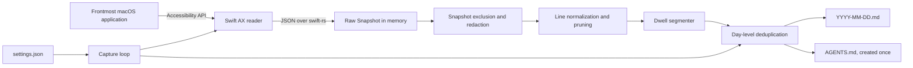

# Architecture

Ambient Context is a local Tauri application with a React settings window and
a Rust capture pipeline. On macOS, a small Swift bridge reads the Accessibility
tree for the frontmost application's focused window.

This document describes the code at `0.1.0`. It is an implementation map, not a
roadmap.

## Data flow

The pipeline is synchronous within each polling tick. There is no database,
queue, server, telemetry client, bundled model, screenshot path, or OCR stage.

## Components

| Component | Location | Responsibility |
| --- | --- | --- |
| React settings UI | `src/components/Setup.tsx` | Permission setup, output-folder selection, capture status, and start/stop control |
| Tauri application shell | `src-tauri/src/lib.rs` | Command boundary, application startup, setup window, and updater implementation |
| Tray controller | `src-tauri/src/tray.rs` | Menu-bar state, persistent start/stop behavior, and file/folder actions |
| Settings store | `src-tauri/src/settings.rs` | JSON settings in Tauri's application config directory |
| Capture loop | `src-tauri/src/capture.rs` | Polling, pipeline orchestration, folder changes, day rollover, and flushing |
| Platform reader | `src-tauri/src/reader/` | Rust interface to platform-specific window readers |
| macOS AX bridge | `src-tauri/plugins/ax/macos/Sources/AxPlugin.swift` | Focused-window discovery and bounded Accessibility-tree traversal |
| Redaction | `src-tauri/src/redact.rs` | Whole-snapshot exclusions and pattern-based replacement |
| Pruning | `src-tauri/src/prune.rs` | Noise removal and text normalization |
| Segmentation | `src-tauri/src/segment.rs` | Converts similar consecutive snapshots into dwell blocks |
| Writer | `src-tauri/src/writer.rs` | Day-level deduplication and append-only Markdown output |

## Capture lifecycle

### 1. Startup

The Tauri application registers the tray and loads `settings.json`. If
Accessibility permission or an output folder is missing, it opens the setup
window. Otherwise it starts capture when `enabled` is true.

An explicit stop writes `enabled: false`; capture therefore stays stopped
across launches until the user starts it again. Capture is on by default only
after setup and only until the user explicitly stops it.

### 2. Polling

The capture loop runs on a dedicated thread. Current defaults are:

- poll interval: 5 seconds
- minimum dwell: 10 seconds
- consecutive-snapshot Jaccard threshold: 0.5

The interval is split into 100 ms sleeps so stop and quit signals are noticed
quickly. A second start request is a no-op while the first capture thread is
running.

### 3. Focused-window read

On macOS the Swift bridge:

1. verifies Accessibility permission;
2. returns no snapshot when the session reports that the screen is locked;
3. selects `NSWorkspace.shared.frontmostApplication`;
4. asks that application for `kAXFocusedWindowAttribute`;
5. walks only that window's Accessibility descendants; and
6. returns the application name, window title, optional document path,
   optional web-area URL, and collected text as JSON.

Accessibility calls use a 500 ms messaging timeout. Tree traversal is bounded
at depth 40, 2,000 collected text values, and 20,000 visited elements. String
values of 8,000 characters or more are not admitted.

The bridge attempts to enable Chromium accessibility once per process. It
tries `AXManualAccessibility` first and then `AXEnhancedUserInterface`. The
first few reads from a newly enabled Chromium or Electron application may be
incomplete while that application builds its Accessibility tree.

### 4. Privacy filtering

Secure-text-field subtrees are skipped by the Swift bridge before their value
or children are read. The Rust layer then:

- discards snapshots for a fixed list of recognized password-manager names;
- discards snapshots whose title contains a recognized private-browsing marker;
- replaces recognized key, token, password, and card-number patterns; and
- attempts to discard the capture output itself.

These controls have different assurance levels and important limitations. See
[Privacy and security](privacy-and-security.md).

### 5. Normalization and pruning

Each retained line has zero-width characters removed, whitespace variants
normalized, and whitespace collapsed. The pruning pass drops empty or
decoration-only values, short interface labels, metric-shaped values, relative
timestamps, media positions, and short pipe-separated navigation menus.

Short values are retained when they look like identifiers, paths, URLs,
emails, versions, dates, or tickets.

### 6. Segmentation

The segmenter keeps one block open. A different application, different window
title, or text similarity below the configured threshold closes the block and
starts another. Similar polls extend the current block and add novel lines.

Blocks shorter than the minimum dwell are discarded. Blocks with no retained
text are also discarded. A URL or document path that appears on a later poll
can fill a previously missing reference on the open block.

Three consecutive failed reads flush the open block. Stop, quit, and an output
folder change also flush it so the final stretch is not silently lost.

### 7. Writing and deduplication

The writer appends each finished block to the file for the block's start date.
It always writes a retained block's heading and references, but writes a body
line only on its first admission that day.

On restart, the writer seeds its deduplication sets from the existing day
file. If the user deletes that file during the same run, the sets reset and a
new file begins cleanly. Changing the output folder also resets deduplication.

The writer creates `AGENTS.md` beside the day files if it does not already
exist. It never overwrites an existing copy because users may customize it.

See [Capture format](capture-format.md) for the output contract and its
interpretation rules.

## Storage and network boundaries

- Day files are plaintext Markdown in the selected folder.
- Settings are plaintext JSON in Tauri's application config directory.
- The current capture path has no network stage.
- Updater code and a GitHub release endpoint are configured, but no automatic
  or startup update check is invoked by the current application.
- Clicking the author link explicitly opens an HTTPS URL in the user's default
  browser.
- What happens after a user gives the capture folder to an agent depends on
  that agent and model; Ambient Context cannot enforce the downstream data
  boundary.

## Error behavior

Most capture-time failures are fail-soft: they are written to standard error
and the next poll continues. Missing Accessibility permission, a locked screen,
no focused window, malformed bridge JSON, or a hung target produces no
snapshot. Write failures are logged and do not stop the loop.

This favors an unobtrusive background process, but it also means a gap in a day
file does not identify its cause. It may represent capture being stopped,
missing permission, a locked screen, an inaccessible application, a short
visit, pruned content, or a runtime failure.

## Verification

The Rust suite covers redaction patterns, application/title exclusions,
normalization, segmentation, self-output detection, settings behavior,
deduplication, and file rendering. The frontend has a TypeScript production
build but no automated UI tests. The Swift Accessibility traversal and
real-application coverage require manual testing; `docs/census.md` is the
current test protocol.
